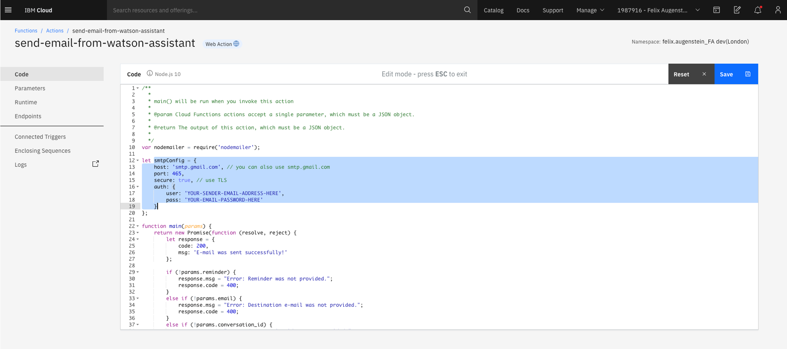
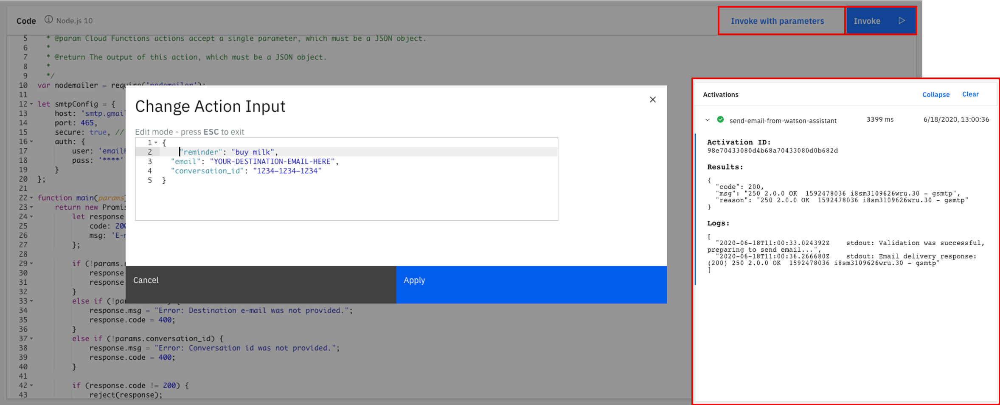
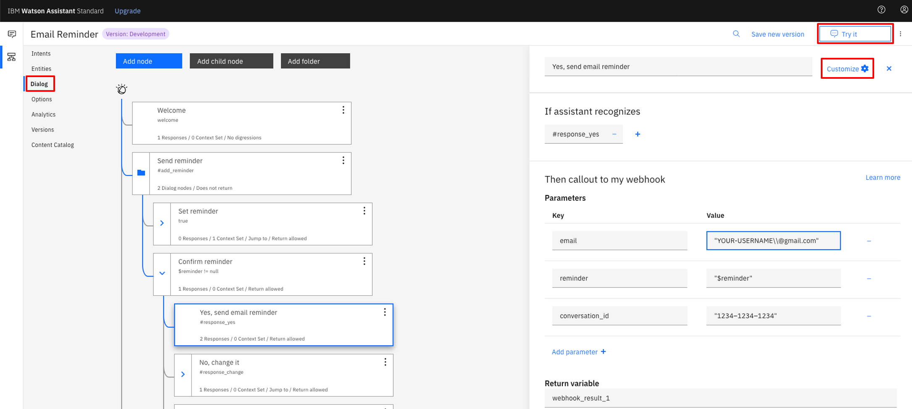
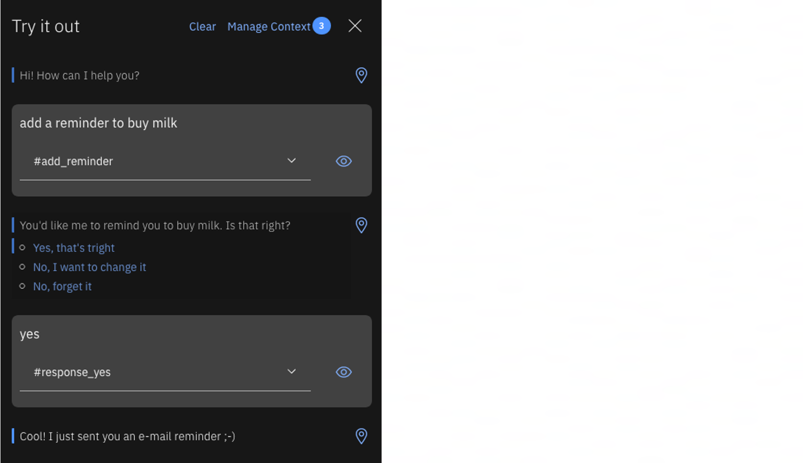

<h1 align="center" style="border-bottom: none;">:rocket: IBM Digital Tech Tutorial: Webhooks</h1>
<h3 align="center">In this hands-on tutorial you will create a Watson Assistant that is able to send you a reminder via e-mail. You can tell Watson to "add a reminder to buy milk", Watson confirms the reminder, and the reminder is sent via e-mail to the destination you provided.</h3>

## Prerequisites

1. Sign up for an [IBM Cloud account](https://cloud.ibm.com/registration).
2. Fill in the required information and press the „Create Account“ button.
3. After you submit your registration, you will receive an e-mail from the IBM Cloud team with details about your account. In this e-mail, you will need to click the link provided to confirm your registration.
4. Now you should be able to login to your new IBM Cloud account ;-)

## Set up the cloud function

After the login you will see your IBM Cloud Dashboard. Click the Cloud Functions button, then go to Actions and click create, to create a new action.


Give your action a name, keep the Default Package and choose Node.js as your runtime. Click create.


Copy and paste the `send-email-from-watson-assistant.js` code and configure `smtpConfig` with your host - for instance `smtp.gmail.com` if you use Gmail and your email and password.



If you use Gmail you have to allow less secure apps and also enable the required functionality with Captcha Enable. Without this, unfortunately the email reminder will not work. You can find detailed instructions about sending emails with Node.js  [here](https://community.nodemailer.com/using-gmail/).

Now you can test your Cloud Function to make sure everything works fine. Therefore save it and click Invoke with Parameters, provide the input below, and click Apply, then click Invoke. Results are shown in the Activations pane.

```
{
  "reminder": "buy milk", 
  "email": "YOUR-DESTINATION-EMAIL-HERE", 
  "conversation_id": "1234–1234–1234"
}
```



Go to Endpoints, enable it as a Web Action, save and copy the provided URL. You will need it later on, when setting up your Watson Assistant.


## Set up the Watson Assistant on the IBM Cloud

In your IBM Cloud Account go to the dashboard by clicking the IBM Logo in the upper left. Go to Catalog and select the AI / Machine Learning category under services or search for Watson Assistant. Then create a new Watson Assistant service, the Lite Plan should work for this tutorial. 


Afterwards launch your Watson Assistant Service, you will find it on your dashboard under services.

Go to skills and create a new skill, when asked choose the dialog skill. Select import skill and upload the `skill-Email-Reminder.json` file.


Click options and then select Webhooks. Provide the Web Action URL you obtained when creating the Endpoint. Make sure to add a `.json` at the end.


Now you can go to the dialog and to the corresponding node to provide your destination-email. When using the `@` character inside the parameter value, it must contain a double backslash `\\` afterwards, because the @ is a syntax for entities. Then you can try it and send a reminder to yourself. Under customize you can enable or disable webhooks.





## If you have any questions just contact me
Felix Augenstein<br>
Digital Tech Ecosystem & Developer Representative @IBM<br>
Twitter: [@F_Augenstein](https://twitter.com/F_Augenstein)<br>
LinkedIn: [linkedin.com/in/felixaugenstein](https://www.linkedin.com/in/felixaugenstein/)
